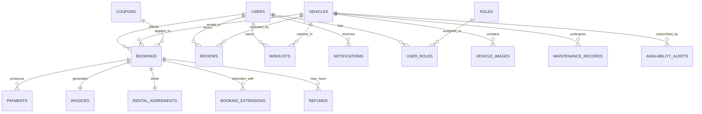

# RideRent System Architecture & Specification Document
**Tagline:** *Rent. Ride. Return.*  
**Version:** 1.0.0  
**Date:** 2026-10-05  

---

## 1. System Overview

**RideRent** is an enterprise-grade Vehicle Rental & Fleet Management platform designed with a strict, minimal **Black + White** visual design system. The system enables seamless end-to-end customer vehicle browsing, dynamic booking, extensions, demo payments, invoices, digital rental agreements, and vehicle reviews, paired with a robust administrative fleet management, maintenance tracking, coupon management, and analytics portal.

### Key Architectural Pillars
- **Zero AI Features:** Focused purely on commercial vehicle rental and fleet management operations.
- **Single Source of Truth Pricing:** All base costs, discounts, taxes, security deposits, and extension fees are calculated exclusively on the backend.
- **Robust Concurrency & Availability:** Overlapping booking prevention, maintenance locks, and state transitions (`PENDING`, `CONFIRMED`, `ACTIVE`, `COMPLETED`, `CANCELLED`, `EXTENDED`).
- **Role-Based Access Control:** Secure stateless JWT authentication with dual roles (`ROLE_USER`, `ROLE_ADMIN`).
- **Monochrome Design Philosophy:** Pure black (`#000000`), white (`#FFFFFF`), off-white (`#F8F8F8`), dark gray (`#111111`), secondary gray (`#666666`), and subtle borders (`#E5E5E5`).

---

## 2. Technology Stack & Folder Structure

### Frontend Stack
- **Framework:** React 18+ with TypeScript
- **Bundler:** Vite
- **Styling:** Vanilla Tailwind CSS with custom monochrome palette
- **Icons:** Lucide React
- **Routing:** React Router DOM (v6)
- **HTTP Client:** Axios (with request/response interceptors for JWT injection and error toasts)

### Backend Stack
- **Framework:** Java 17/21/26 + Spring Boot 3.x
- **Modules:** Spring Web, Spring Data JPA, Spring Security, Hibernate, Bean Validation, Lombok
- **Authentication:** Stateless JSON Web Token (jjwt 0.12.x) + BCrypt (strength 12)
- **Database Driver:** MySQL Connector/J (with optional H2 profile for seamless zero-setup testing)

### Directory Layout

```text
Vehcile_Rental_System/
├── ARCHITECTURE.md
├── README.md
├── backend/
│   ├── pom.xml
│   ├── .env.example
│   └── src/
│       ├── main/
│       │   ├── java/com/vehiclerental/
│       │   │   ├── VehicleRentalApplication.java
│       │   │   ├── config/              # WebMvc, Security, Cors, OpenAPI config
│       │   │   ├── controller/          # REST Controllers
│       │   │   ├── dto/
│       │   │   │   ├── request/         # Auth, Booking, Vehicle, Coupon DTOs
│       │   │   │   └── response/        # ApiResponse, JwtResponse, Summary DTOs
│       │   │   ├── entity/              # JPA Entities
│       │   │   ├── exception/           # GlobalExceptionHandler & custom exceptions
│       │   │   ├── mapper/              # Entity to DTO mappers
│       │   │   ├── repository/          # Spring Data JPA Repositories
│       │   │   ├── security/            # JwtFilter, JwtUtils, UserDetailsServiceImpl
│       │   │   ├── service/             # Service interfaces
│       │   │   │   └── impl/            # Business logic implementations
│       │   │   └── util/                # InvoicePdfGenerator, DateUtils
│       │   └── resources/
│       │       ├── application.yml
│       │       ├── application-dev.yml
│       │       ├── application-prod.yml
│       │       └── data-seed.sql
│       └── test/
└── frontend/
    ├── package.json
    ├── vite.config.ts
    ├── tailwind.config.js
    ├── tsconfig.json
    ├── .env.example
    ├── index.html
    └── src/
        ├── assets/
        ├── components/
        │   ├── common/      # Button, Input, Modal, Badge, Toast, Loader, Pagination
        │   ├── layout/      # Navbar, Footer, UserSidebar, AdminSidebar
        │   ├── vehicle/     # VehicleCard, VehicleGallery, VehicleFilter, CompareDrawer
        │   ├── booking/     # BookingSummary, PriceBreakdown, AgreementModal, InvoiceModal
        │   └── admin/       # MetricCard, ChartComponent, MaintenanceModal
        ├── context/         # AuthContext, ToastContext, WishlistContext, CompareContext
        ├── hooks/           # useAuth, useDebounce, useToast
        ├── pages/
        │   ├── public/      # Home, Vehicles, VehicleDetails, Compare, About, Contact
        │   ├── auth/        # Login, Register, ForgotPassword
        │   ├── user/        # Overview, MyBookings, ActiveRental, Wishlist, Profile, Notifications
        │   └── admin/       # Dashboard, Vehicles, Bookings, Users, Coupons, Maintenance, Reviews
        ├── routes/          # AppRoutes, ProtectedRoute, AdminRoute
        ├── services/        # api.ts, authService, vehicleService, bookingService, adminService
        ├── types/           # index.ts (TypeScript interfaces for entities & payloads)
        └── utils/           # formatters (currency, dates), validators
```

---

## 3. Database Schema & Relational Design



### Relational Tables & Indexes

1. **users**
   - `id` (BIGINT, PK, AUTO_INCREMENT)
   - `full_name` (VARCHAR(100), NOT NULL)
   - `email` (VARCHAR(120), UNIQUE, NOT NULL, INDEX)
   - `password` (VARCHAR(255), NOT NULL)
   - `phone` (VARCHAR(20), NOT NULL)
   - `profile_photo` (VARCHAR(500))
   - `is_active` (BOOLEAN, DEFAULT TRUE)
   - `created_at`, `updated_at` (TIMESTAMP)

2. **roles** & **user_roles**
   - `role_id` (INT, PK), `name` (VARCHAR(30), e.g., `ROLE_USER`, `ROLE_ADMIN`)

3. **vehicles**
   - `id` (BIGINT, PK, AUTO_INCREMENT)
   - `brand` (VARCHAR(60), NOT NULL, INDEX)
   - `model` (VARCHAR(60), NOT NULL)
   - `year` (INT, NOT NULL)
   - `vehicle_type` (ENUM: `CAR`, `BIKE`, `SUV`, `SEDAN`, `HATCHBACK`, `LUXURY`, `VAN`, INDEX)
   - `registration_number` (VARCHAR(30), UNIQUE, NOT NULL)
   - `description` (TEXT)
   - `price_per_day` (DECIMAL(10,2), NOT NULL)
   - `security_deposit` (DECIMAL(10,2), NOT NULL)
   - `fuel_type` (VARCHAR(30), NOT NULL) -- Petrol, Diesel, Electric, Hybrid
   - `transmission` (VARCHAR(20), NOT NULL) -- Automatic, Manual
   - `seating_capacity` (INT, NOT NULL)
   - `location` (VARCHAR(100), NOT NULL, INDEX)
   - `status` (ENUM: `AVAILABLE`, `BOOKED`, `RENTED`, `MAINTENANCE`, `OUT_OF_SERVICE`, INDEX)
   - `rating` (DECIMAL(3,2), DEFAULT 5.00)
   - `total_reviews` (INT, DEFAULT 0)
   - `featured` (BOOLEAN, DEFAULT FALSE)
   - `created_at`, `updated_at` (TIMESTAMP)

4. **vehicle_images**
   - `id` (BIGINT, PK, AUTO_INCREMENT)
   - `vehicle_id` (BIGINT, FK -> vehicles.id, INDEX)
   - `image_url` (VARCHAR(500), NOT NULL)
   - `is_primary` (BOOLEAN, DEFAULT FALSE)

5. **bookings**
   - `id` (BIGINT, PK, AUTO_INCREMENT)
   - `booking_reference` (VARCHAR(36), UNIQUE, NOT NULL, INDEX)
   - `user_id` (BIGINT, FK -> users.id, INDEX)
   - `vehicle_id` (BIGINT, FK -> vehicles.id, INDEX)
   - `pickup_date` (DATETIME, NOT NULL, INDEX)
   - `return_date` (DATETIME, NOT NULL, INDEX)
   - `pickup_location` (VARCHAR(120), NOT NULL)
   - `return_location` (VARCHAR(120), NOT NULL)
   - `base_amount` (DECIMAL(10,2), NOT NULL)
   - `discount_amount` (DECIMAL(10,2), DEFAULT 0.00)
   - `tax_amount` (DECIMAL(10,2), NOT NULL)
   - `security_deposit` (DECIMAL(10,2), NOT NULL)
   - `total_amount` (DECIMAL(10,2), NOT NULL)
   - `status` (ENUM: `PENDING`, `CONFIRMED`, `ACTIVE`, `COMPLETED`, `CANCELLED`, `EXTENDED`, INDEX)
   - `coupon_id` (BIGINT, FK -> coupons.id, NULLABLE)
   - `cancellation_reason` (TEXT)
   - `created_at`, `updated_at` (TIMESTAMP)

6. **booking_extensions**
   - `id` (BIGINT, PK, AUTO_INCREMENT)
   - `booking_id` (BIGINT, FK -> bookings.id, INDEX)
   - `previous_return_date` (DATETIME, NOT NULL)
   - `extended_return_date` (DATETIME, NOT NULL)
   - `additional_days` (INT, NOT NULL)
   - `additional_amount` (DECIMAL(10,2), NOT NULL)
   - `created_at` (TIMESTAMP)

7. **payments**
   - `id` (BIGINT, PK, AUTO_INCREMENT)
   - `booking_id` (BIGINT, FK -> bookings.id, INDEX)
   - `amount` (DECIMAL(10,2), NOT NULL)
   - `payment_method` (ENUM: `CARD`, `UPI`, `CASH`, NOT NULL)
   - `status` (ENUM: `PENDING`, `SUCCESS`, `FAILED`, `REFUNDED`, INDEX)
   - `transaction_reference` (VARCHAR(64), UNIQUE, NOT NULL)
   - `demo_note` (VARCHAR(100), DEFAULT 'Simulated Demo Payment')
   - `created_at` (TIMESTAMP)

8. **refunds**
   - `id` (BIGINT, PK, AUTO_INCREMENT)
   - `booking_id` (BIGINT, FK -> bookings.id)
   - `payment_id` (BIGINT, FK -> payments.id)
   - `refund_amount` (DECIMAL(10,2), NOT NULL)
   - `cancellation_fee` (DECIMAL(10,2), NOT NULL)
   - `refund_reason` (TEXT)
   - `status` (VARCHAR(30))
   - `created_at` (TIMESTAMP)

9. **coupons**
   - `id` (BIGINT, PK, AUTO_INCREMENT)
   - `code` (VARCHAR(30), UNIQUE, NOT NULL, INDEX)
   - `discount_type` (ENUM: `PERCENTAGE`, `FIXED`, NOT NULL)
   - `discount_value` (DECIMAL(10,2), NOT NULL)
   - `minimum_booking_amount` (DECIMAL(10,2), DEFAULT 0.00)
   - `maximum_discount` (DECIMAL(10,2))
   - `start_date` (DATETIME, NOT NULL)
   - `expiry_date` (DATETIME, NOT NULL)
   - `usage_limit` (INT, DEFAULT 1000)
   - `times_used` (INT, DEFAULT 0)
   - `active` (BOOLEAN, DEFAULT TRUE)

10. **maintenance_records**
    - `id` (BIGINT, PK, AUTO_INCREMENT)
    - `vehicle_id` (BIGINT, FK -> vehicles.id, INDEX)
    - `maintenance_type` (ENUM: `SERVICE`, `REPAIR`, `OIL_CHANGE`, `TYRE_CHANGE`, `INSPECTION`, `OTHER`)
    - `description` (TEXT, NOT NULL)
    - `cost` (DECIMAL(10,2), NOT NULL)
    - `start_date` (DATE, NOT NULL)
    - `end_date` (DATE)
    - `status` (ENUM: `SCHEDULED`, `IN_PROGRESS`, `COMPLETED`)
    - `notes` (TEXT)

11. **reviews**
    - `id` (BIGINT, PK, AUTO_INCREMENT)
    - `vehicle_id` (BIGINT, FK -> vehicles.id, INDEX)
    - `user_id` (BIGINT, FK -> users.id, INDEX)
    - `booking_id` (BIGINT, FK -> bookings.id, UNIQUE) -- 1 review per completed booking
    - `rating` (INT, CHECK between 1 and 5)
    - `comment` (TEXT, NOT NULL)
    - `is_hidden` (BOOLEAN, DEFAULT FALSE)
    - `created_at` (TIMESTAMP)

12. **wishlists**
    - `id` (BIGINT, PK, AUTO_INCREMENT)
    - `user_id` (BIGINT, FK -> users.id, INDEX)
    - `vehicle_id` (BIGINT, FK -> vehicles.id, INDEX)
    - UNIQUE KEY (`user_id`, `vehicle_id`)

13. **notifications**
    - `id` (BIGINT, PK, AUTO_INCREMENT)
    - `user_id` (BIGINT, FK -> users.id, INDEX)
    - `title` (VARCHAR(150), NOT NULL)
    - `message` (TEXT, NOT NULL)
    - `type` (VARCHAR(50)) -- BOOKING, PAYMENT, CANCELLATION, EXTENSION, AVAILABILITY, REMINDER
    - `is_read` (BOOLEAN, DEFAULT FALSE)
    - `created_at` (TIMESTAMP)

14. **invoices** & **rental_agreements**
    - Generated digital records tied directly to confirmed bookings.

---

## 4. API Specification

All responses follow standard envelope:
```json
{
  "success": true,
  "message": "Operation successful",
  "data": { ... }
}
```

### 4.1 Authentication (`/api/auth`)
- `POST /api/auth/register` - Creates user account with `ROLE_USER`
- `POST /api/auth/login` - Authenticates credentials, returns JWT token + user profile
- `GET  /api/auth/me` - Validates token and returns current user info
- `POST /api/auth/forgot-password` - Initiates password reset token flow
- `POST /api/auth/reset-password` - Completes password reset

### 4.2 Vehicles (`/api/vehicles`)
- `GET /api/vehicles` - Search, filter by type, location, price min/max, seats, transmission, sort
- `GET /api/vehicles/{id}` - Details with images, specifications, review summary
- `GET /api/vehicles/featured` - Highlighted vehicles for landing page
- `GET /api/vehicles/{id}/availability?pickupDate=...&returnDate=...` - Validates availability

### 4.3 Wishlist & Comparison (`/api/wishlist`, `/api/vehicles/compare`)
- `GET  /api/wishlist` - Get current user wishlist
- `POST /api/wishlist/{vehicleId}` - Add vehicle to wishlist
- `DELETE /api/wishlist/{vehicleId}` - Remove vehicle
- `POST /api/vehicles/compare` - Compare 2–3 vehicles side-by-side

### 4.4 Bookings (`/api/bookings`)
- `POST /api/bookings/quote` - Calculate dynamic pricing (base, discount, tax, deposit, total)
- `POST /api/bookings` - Create booking (validates overlap & maintenance, status: `PENDING`)
- `GET  /api/bookings/my` - User's booking history
- `GET  /api/bookings/my/active` - Current active rental with countdown & return info
- `GET  /api/bookings/{id}` - Booking details with invoice & agreement
- `PUT  /api/bookings/{id}/modify` - Modify dates/location (recalculates pricing & checks overlap)
- `POST /api/bookings/{id}/extend` - Extend rental days
- `POST /api/bookings/{id}/cancel` - Cancel booking and compute refund breakdown

### 4.5 Coupons (`/api/coupons`)
- `POST /api/coupons/validate` - Validates code, minimum booking requirement, expiry date

### 4.6 Payments (`/api/payments`)
- `POST /api/payments/demo` - Simulates payment for a pending booking, activates booking, issues invoice

### 4.7 Reviews (`/api/reviews`)
- `GET  /api/vehicles/{vehicleId}/reviews` - List approved reviews
- `POST /api/reviews` - Submit review (verified renter rule enforced)
- `PUT  /api/reviews/{id}` - Update review
- `DELETE /api/reviews/{id}` - Delete user review

### 4.8 Notifications (`/api/notifications`)
- `GET  /api/notifications` - User notifications list & unread count
- `PUT  /api/notifications/{id}/read` - Mark specific notification as read
- `PUT  /api/notifications/read-all` - Mark all as read
- `POST /api/vehicles/{id}/notify-availability` - Subscribe to alert when vehicle is back in service

### 4.9 Admin Endpoints (`/api/admin/*`)
- `GET  /api/admin/dashboard/stats` - Metric counts (Users, Fleet, Revenue, Active, Maintenance)
- `GET  /api/admin/dashboard/analytics` - Revenue by month, booking trends, fleet category split
- `GET  /api/admin/users` - Paginated user management, status toggles
- `PUT  /api/admin/users/{id}/status` - Activate/Deactivate user
- `POST /api/admin/vehicles` - Add new vehicle with specs
- `PUT  /api/admin/vehicles/{id}` - Update vehicle info
- `DELETE /api/admin/vehicles/{id}` - Soft-delete/deactivate vehicle
- `GET  /api/admin/bookings` - All bookings with status filter
- `PUT  /api/admin/bookings/{id}/status` - Transition booking status
- `POST /api/admin/coupons` - Create promo codes
- `GET  /api/admin/maintenance` - Fleet maintenance list
- `POST /api/admin/maintenance` - Mark vehicle for maintenance (sets vehicle status `MAINTENANCE`)
- `PUT  /api/admin/maintenance/{id}/complete` - Complete maintenance, restore vehicle to `AVAILABLE`
- `GET  /api/admin/reviews` - Moderate reviews (hide/unhide/delete)

---

## 5. Security & Authentication Architecture

1. **Password Encryption:** Passwords hashed with `BCryptPasswordEncoder(12)`.
2. **Stateless JWT Tokens:** Contains subject (`username`), claims (`roles`, `userId`), signed with HMAC-SHA256. Expire after 24 hours.
3. **Security Filter Chain:**
   - Public paths: `/api/auth/**`, `/api/vehicles/**`, `/api/coupons/validate`, `/h2-console/**`
   - User paths: `/api/bookings/**`, `/api/wishlist/**`, `/api/reviews/**`, `/api/payments/**`, `/api/notifications/**`
   - Admin paths: `/api/admin/**` (Strictly `hasRole('ADMIN')`)
4. **CORS Configuration:** Explicitly permits frontend origin, credentials enabled, allowed methods `GET, POST, PUT, DELETE, OPTIONS, PATCH`.

---

## 6. Business Logic & Constraints

1. **No Overlapping Bookings:**
   ```sql
   SELECT COUNT(b) FROM Booking b 
   WHERE b.vehicle.id = :vehicleId 
     AND b.status IN ('CONFIRMED', 'ACTIVE', 'EXTENDED') 
     AND NOT (b.returnDate <= :pickupDate OR b.pickupDate >= :returnDate)
   ```
2. **Maintenance Protection:**
   If `vehicle.status == MAINTENANCE` or `vehicle.status == OUT_OF_SERVICE`, immediate rejection of booking requests.
3. **Verified Renter Review Rule:**
   User can only submit a review for a vehicle if they have at least one booking for that vehicle with status `COMPLETED` and haven't already reviewed that specific booking.
4. **Cancellation Refund Logic:**
   - \> 48 hours before pickup: 100% refund of base amount + security deposit - 0% fee.
   - 24–48 hours before pickup: 80% refund of base amount + 100% security deposit.
   - < 24 hours before pickup: 50% refund of base amount + 100% security deposit.
5. **Dynamic Extension:**
   When extending, the system verifies `extendedReturnDate` does not conflict with subsequent bookings, computes daily rate * extension days + applicable tax, updates `booking.returnDate`, and records a `BookingExtension` log.

---

## 7. Frontend UI / UX Architecture

### Monochrome Token System
- `bg-primary`: `#FFFFFF`
- `bg-secondary`: `#F8F8F8`
- `bg-dark`: `#000000`
- `text-primary`: `#111111`
- `text-muted`: `#666666`
- `text-inverted`: `#FFFFFF`
- `border-subtle`: `#E5E5E5`
- `border-dark`: `#111111`
- `badge-dark`: `bg-black text-white`
- `badge-light`: `bg-gray-100 text-gray-900 border border-gray-200`

### Responsive Breakpoints
- **Mobile (< 768px):** Collapsible drawer navigation, single-column cards, full-width modal sheets.
- **Tablet (768px - 1024px):** 2-column vehicle grid, scrollable data tables.
- **Desktop (> 1024px):** 3-column vehicle grid, fixed sticky filters, comprehensive dashboard metrics and split-pane previews.

---

## 8. Verification & Test Plan

1. **Unit & Integration Tests:**
   - Auth workflow (register, login, JWT validation).
   - Dynamic price calculation math.
   - Double-booking race condition prevention.
   - Maintenance availability lock.
   - Verified renter review eligibility.
2. **End-to-End User Flow:**
   - Search vehicles -> Filter -> Select Dates -> Quote -> Apply coupon -> Demo payment -> View booking -> Download invoice -> View agreement.
3. **End-to-End Admin Flow:**
   - View KPI cards -> Add vehicle -> Put vehicle into maintenance -> Verify unavailable on public catalog -> Complete maintenance -> Moderate reviews.
